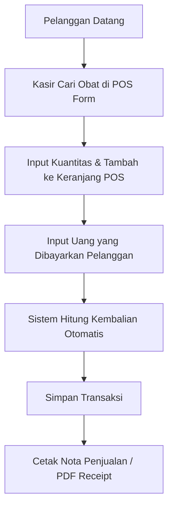
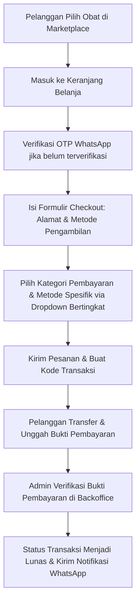
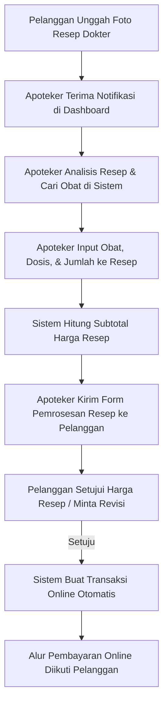

# Laporan Analisis & Inventory Fitur - Mekar Pharmacy
Dokumen ini disusun sebagai bagian dari persiapan Pengujian PPKPL (Perancangan, Pemrograman, dan Pengujian Kualitas Perangkat Lunak) untuk proyek aplikasi Mekar Pharmacy. Proyek ini dibangun di atas Laravel 11.

---

## 1. STRUKTUR MODUL UTAMA (MODULE OVERVIEW)
Sistem Mekar Pharmacy terbagi menjadi **8 Modul Utama**:
1. **Modul Autentikasi & Verifikasi OTP**: Pendaftaran, masuk, pengaturan kata sandi, serta pengamanan dengan verifikasi OTP WhatsApp (melalui integrasi nomor HP) untuk pelanggan sebelum melakukan transaksi checkout/unggah resep.
2. **Modul Backoffice Dashboard (Admin, Apoteker, Kasir)**: Halaman pantau ringkasan statistik apotek (Total pendapatan, obat, supplier, pelanggan, status transaksi online, chart statistik penjualan bulanan, dsb.) sesuai hak akses masing-masing.
3. **Modul Manajemen Master Data (CRUD Master)**: Pengelolaan Kategori Obat, Distributor/Supplier, Data Obat (termasuk fitur import template excel), dan data Pelanggan.
4. **Modul Point of Sale (POS / Transaksi Kasir)**: Pencatatan pembelian langsung di kasir apotek, pencarian obat interaktif, perhitungan kembalian otomatis, penyimpanan transaksi, dan cetak struk nota (PDF).
5. **Modul Marketplace Pelanggan**: Halaman katalog obat publik, penyaringan obat per kategori, status ketersediaan stok obat (Tersedia / Habis), keranjang belanja (cart), proses checkout belanja online, dan pelacakan pesanan saya.
6. **Modul Resep Dokter Online**: Pengunggahan foto resep oleh pelanggan, pemrosesan obat resep oleh apoteker (menentukan obat & kuantitas), persetujuan revisi resep/harga oleh pelanggan, dan pembuatan invoice pembayaran otomatis.
7. **Modul Verifikasi & Pembayaran Online**: Unggah bukti transfer/pembayaran oleh pelanggan, kustomisasi dinamis metode pembayaran di backoffice admin (Transfer Bank, E-Wallet, QRIS) dengan seleksi bertingkat pada sisi pelanggan, serta verifikasi pembayaran manual oleh admin.
8. **Modul Laporan & RBAC (Role-Based Access Control)**:
   * **Laporan**: Rekapitulasi penjualan berdasarkan periode tanggal dan ekspor data ke format PDF & Excel.
   * **RBAC**: Pengelolaan data User/Staff (Admin, Apoteker, Kasir, Pelanggan), Roles, dan Permissions menggunakan Spatie Laravel Permission.
   * **WhatsApp Diagnostic**: Halaman pengujian gateway pengiriman notifikasi WhatsApp.

---

## 2. DAFTAR MENU (MENU INVENTORY)
Berdasarkan aktor yang masuk ke sistem, menu yang tersedia adalah sebagai berikut:

### A. Backoffice Side Navigation Menu (Staff/Admin/Kasir/Apoteker)
* **Beranda (Dashboard)** (Akses: Admin, Kasir)
* **Apoteker Dashboard** (Akses: Apoteker)
* **Master Data**:
  * **Kategori Obat** (Akses: Admin/Staff dengan permission `Lihat Kategori`)
  * **Supplier** (Akses: Admin/Staff dengan permission `Lihat Supplier`)
  * **Obat / Produk** (Akses: Admin/Staff dengan permission `Lihat Obat`)
  * **Pelanggan** (Akses: Admin/Staff dengan permission `Lihat Pelanggan`)
* **Transaksi Kasir (POS)** (Akses: Kasir/Admin dengan permission `Tambah Transaksi`)
* **Riwayat Transaksi** (Akses: Kasir/Admin dengan permission `Lihat Transaksi`)
* **Pesanan Online**:
  * **Verifikasi Resep** (Akses: Apoteker/Admin dengan permission `Verifikasi Resep` & `Kelola Pesanan Online`)
  * **Transaksi Online** (Akses: Admin dengan permission `Kelola Pesanan Online`)
* **Ulasan Layanan (Feedback)** (Akses: Admin dengan permission `Kelola Pesanan Online`)
* **Laporan Penjualan** (Akses: Admin, Kasir)
* **Pengaturan Sistem (RBAC & Config)**:
  * **Manajemen User** (Akses: Admin dengan permission `Lihat User`)
  * **Manajemen Role** (Akses: Admin dengan permission `Lihat Role`)
  * **Manajemen Permission** (Akses: Admin dengan permission `Lihat Permission`)
  * **Metode Pembayaran** (Akses: Admin dengan permission `Lihat User`)
  * **Diagnostik WhatsApp** (Akses: Admin dengan permission `Lihat User`)

### B. Marketplace & Portal Menu (Pelanggan)
* **Home / Beranda Marketplace**
* **Katalog Produk (Semua Produk)**
* **Keranjang Belanja (Cart)**
* **Unggah Resep Dokter**
* **Resep Saya (Riwayat Unggah Resep)**
* **Pesanan Saya (Riwayat Order & Invoice)**
* **Profil Pelanggan**
* **Hubungi Kami / Layanan Konsultasi Apoteker**
* **Ulasan & Feedback Layanan Apotek**

---

## 3. PROSES BISNIS UTAMA (CORE BUSINESS FLOWS)

### A. Alur Pembelian Kasir (POS Flow)

### B. Alur Pembelian Online (Marketplace Checkout Flow)

### C. Alur Tebus Resep Dokter Online (Prescription Handling Flow)

---

## 4. INVENTORY FITUR (FEATURE INVENTORY TABLE)

Berikut adalah daftar lengkap seluruh fitur di Mekar Pharmacy beserta detail implementasi teknis dan prioritas pengujian:

| Modul / Kategori | Nama Fitur | Penjelasan Singkat | Lokasi Controller | Lokasi Blade | Route Utama | Prioritas |
| :--- | :--- | :--- | :--- | :--- | :--- | :---: |
| **Autentikasi & Akun** | Registrasi Akun Pelanggan | Pendaftaran akun pelanggan baru ke database. | `Auth\RegisteredUserController` | `auth/register.blade.php` | `GET/POST /register` | High |
| | Login Multi-Role (RBAC) | Otentikasi user dan pengalihan ke dashboard yang sesuai (Admin, Apoteker, Kasir, Pelanggan). | `Auth\AuthenticatedSessionController` | `auth/login.blade.php` | `GET/POST /login` | High |
| | Verifikasi OTP WhatsApp | Pengiriman & pencocokan kode OTP via WhatsApp ke nomor telepon pelanggan untuk validasi status aktif. | `Auth\OtpVerificationController` | `auth/otp-verify.blade.php` | `GET/POST /otp/verify` | High |
| | Reset Kata Sandi | Alur reset password menggunakan email recovery link. | `Auth\PasswordResetLinkController`, `Auth\NewPasswordController` | `auth/forgot-password.blade.php`, `auth/reset-password.blade.php` | `/forgot-password`, `/reset-password/{token}` | Medium |
| | Manajemen Profil User | Memperbarui nama, email, nomor HP, dan password pengguna aktif. | `ProfileController` | `profile/edit.blade.php` | `GET/PATCH/DELETE /profile` | Medium |
| **Backoffice Dashboard** | Dashboard Statistik Admin / Kasir | Menampilkan widget total pendapatan, grafik bulanan, jumlah obat, supplier, dan daftar verifikasi tertunda. | `DashboardController` | `dashboard/index.blade.php` | `GET /dashboard` | High |
| | Dashboard Apoteker | Menampilkan daftar resep dokter masuk yang butuh verifikasi segera. | `ApotekerDashboardController` | `apoteker/resep/index.blade.php` | `GET /apoteker/dashboard` | High |
| **Master Data CRUD** | CRUD Kategori Obat | Membuat, membaca, mengupdate, dan menghapus kategori sediaan obat apotek. | `KategoriController` | `kategori/index.blade.php`, `create.blade.php`, `edit.blade.php` | `Resource: /kategori` | Medium |
| | CRUD Supplier | Membuat, membaca, mengupdate, dan menghapus data distributor/supplier obat resmi. | `SupplierController` | `supplier/index.blade.php`, `create.blade.php`, `edit.blade.php`, `show.blade.php` | `Resource: /supplier` | Medium |
| | CRUD Obat & Preview Import | Pencatatan data obat lengkap dengan harga, kategori, supplier, stok, gambar, dan import data massal via template Excel. | `ObatController` | `obat/index.blade.php`, `create.blade.php`, `edit.blade.php` | `Resource: /obat`, `/obat/import` | High |
| | CRUD Pelanggan | Manajemen data pelanggan di backoffice, dengan status verifikasi instan oleh admin. | `CustomerController` | `customer/index.blade.php`, `create.blade.php`, `edit.blade.php` | `Resource: /customer` | Medium |
| **RBAC & Pengaturan** | CRUD Role & Permission | Mengelola tingkat otorisasi sistem dan asosiasi permission pada setiap role (Spatie). | `RoleController`, `PermissionController` | `role/index.blade.php`, `permission/index.blade.php`, `create.blade.php`, `edit.blade.php` | `Resource: /role`, `/permission` | Medium |
| | CRUD Staff / User | Menambah & mengedit akun staff internal apotek (Kasir/Apoteker) beserta penetapan role. | `UserController` | `user/index.blade.php`, `create.blade.php`, `edit.blade.php` | `Resource: /user` | Medium |
| | Diagnostik WhatsApp | Tool admin untuk mendiagnosis koneksi API notifikasi WhatsApp dan menguji pengiriman pesan secara langsung. | `WhatsAppDiagnosticController` | `admin/whatsapp-diagnostic.blade.php` | `GET/POST /admin/whatsapp-diagnostic` | Low |
| | CRUD Metode Pembayaran | Mengatur opsi pembayaran mitra (Bank, E-Wallet, QRIS) tanpa modifikasi kode sumber. | `PaymentMethodController` | `payment-methods/index.blade.php`, `create.blade.php`, `edit.blade.php` | `Resource: /admin/payment-methods` | High |
| **POS (Point of Sale)** | Kasir POS Penjualan | Form penjualan kasir luring dengan dynamic search obat, kalkulasi subtotal realtime, dan kalkulasi uang kembalian. | `TransaksiController` | `transaksi/create.blade.php` | `GET/POST /transaksi` | High |
| | Cetak Struk POS (PDF) | Konversi struk penjualan kasir langsung menjadi berkas PDF siap cetak. | `TransaksiController` | `transaksi/export-pdf.blade.php` | `GET /transaksi/export-pdf` | High |
| | Riwayat Transaksi POS | Menampilkan daftar transaksi luring kasir lengkap dengan filter pencarian dan detail penjualan. | `TransaksiController` | `transaksi/index.blade.php`, `show.blade.php` | `GET /transaksi/{id}` | Medium |
| **Marketplace** | Katalog Produk & Detail | Menampilkan obat-obatan aktif di marketplace lengkap dengan badge status ketersediaan stok (`Tersedia`/`Habis`). | `MarketplaceController` | `marketplace/home.blade.php`, `products.blade.php`, `show.blade.php` | `GET /`, `/products`, `/products/{id}` | High |
| | Keranjang Belanja (Cart) | Mengelola item belanja online (tambah kuantitas, ubah, hapus obat dari keranjang) secara dinamis. | `CartController` | `marketplace/cart.blade.php` | `GET/POST /cart` | High |
| | Form Checkout Pelanggan | Pengisian data pengantaran dan pemilihan opsi pembayaran bertingkat. | `CheckoutController` | `marketplace/checkout.blade.php` | `GET/POST /checkout` | High |
| | Invoice Pembayaran | Menampilkan informasi tagihan, kode QRIS dinamis, detil bank/e-wallet terpilih, dan form unggah bukti transfer. | `CheckoutController` | `marketplace/invoice.blade.php` | `GET /invoice/{kode_transaksi}` | High |
| | Pesanan Saya (Riwayat) | Daftar belanjaan online pelanggan beserta status order (Menunggu Pembayaran, Menunggu Verifikasi, Dikirim, dsb.). | `CustomerOrderController` | `marketplace/pesanan-saya.blade.php`, `pdf-invoice.blade.php` | `GET /pesanan-saya` | High |
| | Feedback & Rating Layanan | Ulasan rating bintang dan komentar atas kepuasan layanan apotek yang dikirimkan oleh customer lunas. | `FeedbackLayananController` | `admin/feedback-layanan/index.blade.php` | `POST /feedback-layanan` | Low |
| **Resep Dokter Online** | Unggah Resep (Customer) | Pengunggahan berkas berkas foto/scan resep dokter resmi oleh pelanggan terverifikasi OTP. | `ResepDokterController` | `marketplace/upload-resep.blade.php` | `GET/POST /upload-resep` | High |
| | Pemrosesan Resep (Staff) | Halaman pemrosesan oleh Apoteker untuk mencocokkan resep fisik dengan stok obat sistem, dosis, kuantitas, dan harga. | `ResepDokterController` | `admin/resep-dokter/proses.blade.php` | `GET/POST /resep-dokter/{id}/proses` | High |
| | Persetujuan Resep (Customer) | Pelanggan menyetujui detail obat & nominal kalkulasi resep dari apoteker sebelum diubah menjadi invoice order aktif. | `ResepDokterController` | `marketplace/resep-show.blade.php`, `resep-history.blade.php` | `GET/POST /resep-saya/{id}` | High |
| | Verifikasi Pembayaran Admin | Admin memverifikasi bukti unggah transfer dari transaksi online dan memperbarui status pengiriman barang. | `AdminTransaksiOnlineController` | `admin/transaksi-online/index.blade.php`, `show.blade.php` | `GET/POST /transaksi-online/{id}/verifikasi` | High |
| **Laporan Penjualan** | Ekspor Laporan Penjualan | Pencetakan laporan transaksi apotek ke format PDF dan Excel sesuai rentang tanggal yang dimasukkan. | `LaporanController` | `laporan/index.blade.php` | `GET /laporan`, `/laporan/export-pdf` | High |

---

## 5. ANALISIS TRANSAKSI & PROSES BISNIS TERDAMPAK (TESTING SCORECARD)
Untuk pengujian PPKPL, berikut adalah area kritis yang wajib diuji secara intensif untuk menjamin kualitas perangkat lunak:
1. **Validasi Ketersediaan Stok (Obat & Marketplace)**:
   * Memastikan jika stok obat `0`, badge status pada katalog marketplace berubah menjadi `🔴 Habis`, tombol keranjang dinonaktifkan (`disabled`), dan pelanggan tidak bisa memaksa menambahkannya ke cart.
   * Pada alur POS Kasir, memastikan kasir tidak bisa menjual obat melebihi stok yang tersedia saat itu.
2. **Otorisasi Multi-Role & Middleware**:
   * Melakukan pengujian penetrasi menu di mana aktor Kasir tidak boleh mengakses menu Kategori/Supplier/User, dan pelanggan tidak boleh mengakses dashboard backoffice `/dashboard`.
3. **Penyisihan Notifikasi WhatsApp Gateway**:
   * Memastikan notifikasi WhatsApp terkirim secara berkala saat order dibuat, bukti transfer diunggah, status resep diubah oleh apoteker, dan status pesanan diverifikasi lunas oleh admin.
4. **Fungsionalitas Dropdown Bertingkat pada Checkout**:
   * Menguji dropdown **Pilih Metode** (Transfer Bank / E-Wallet / QRIS) agar berjalan interaktif dengan menampilkan dropdown kedua secara dinamis (**Pilih Bank** / **Pilih E-Wallet**) dengan transisi Alpine.js yang lembut tanpa error script.
5. **Konversi Preskripsi/Resep Dokter**:
   * Memastikan berkas file resep dokter tersimpan secara aman di direktori non-publik dan hanya bisa dibuka oleh staff berwenang menggunakan route terenkripsi (`/resep-dokter/file/{id}`).
